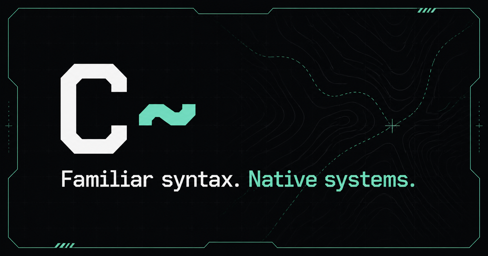

# C~ Compiler and Debugger for Visual Studio Code



[C~ website](https://ctilde.sbarisic.com) · [Source code and issue tracker](https://github.com/sbarisic/CTilde)

This extension adds C~ (`.ct`) IntelliSense plus lexical and compiler-aware highlighting. It launches the repository's .NET language server as a separate process and uses the same compiler declarations, diagnostics, targets, and bundled standard library as command-line builds.

This is a preview for the experimental C~ Draft 0.46 language. The extension, language server, compiler, and debug adapter are versioned and released together.

## Requirements

- Visual Studio Code 1.85 or newer.
- The [.NET 10 runtime](https://dotnet.microsoft.com/download/dotnet/10.0). The package includes the C~ compiler and language server, but not the .NET runtime.
- A supported native C toolchain for native builds.
- GDB for C~-aware GCC, Clang, WSL, or ESP-IDF debugging.
- The Microsoft C/C++ extension for MSVC debugging.

If `dotnet`, the native compiler, or the debugger is outside `PATH`, configure its path in the C~ settings.

## Installation

After the Marketplace preview is published, search for **C~ Compiler and Debugger** in the Extensions view. To install a downloaded package instead, run:

```powershell
code --install-extension .\ctilde-language-0.15.0.vsix --force
```

## Features

- Syntax highlighting for declarations, keywords, literals, attributes, comments, operators, and punctuation.
- Compiler-aware highlighting for resolved namespaces, classes, structs, enums, enum members, parameters, locals, properties, fields, methods, and constructors.
- Semantic modifiers for declarations, static and readonly symbols, and embedded standard-library references.
- Comment toggling for `//` and `/* */` comments.
- Bracket matching, automatic closing, surrounding pairs, brace indentation, and region folding.
- Unicode identifiers and keyword identifiers escaped with `@`.
- Current Draft 0.46 syntax and semantic classification, including `System.Storage`, Runtime ABI 19 managed filesystem services, `[NativeImport]`, ESP-IDF managed-module manifests, `simdOptimizations`, `Vec3x4`, generic collections, indexers, iterators, explicit SIMD128 values, scalar geometry, repository modules, source owners, closures, interrupts, effect contracts, target profiles, runtime roles, and native interop.
- Target-aware standard-library completion and documentation: hosted and Cosmopolitan supply console/file APIs, ESP-IDF supplies its bindings, and freestanding exposes only its core runtime-independent surface.
- Cosmopolitan manifests are schema-validated and participate in check, build, and run tasks. C~-aware APE debugging remains deferred to a retained ELF-carrier workflow.
- Context-aware completion for keywords, types, locals, parameters, fields, properties, methods, enum members, and namespaces.
- C#-style method completion that collapses overloads into one row with an overload count while retaining every signature after `(` and `,`.
- Recovery-aware member completion for incomplete expressions in any manifest source, including non-main files in multi-file projects.
- C#-style `///` XML documentation in lazily resolved completion details, hover, and signature help, including active-parameter descriptions.
- Static/instance, inheritance, accessibility, lexical-scope, overload, and hosted/ESP-IDF filtering.
- Live compiler diagnostics with related locations.
- Hover, signature help, go-to-definition, exact cross-project references, document symbols, and workspace symbols.
- Read-only navigation into embedded `System` and `Esp.Idf` sources.
- JSON validation for `ctilde.json` projects and ESP-IDF binding manifests.
- Check, native Build, rebuild-and-Run, Debug, and Attach commands for workspace projects.


Supported documentation elements are `summary`, `param`, `returns`, `remarks`, `exception`, `see`, `paramref`, and sole-element `inheritdoc`. Documentation warnings remain non-blocking. Links, documentation-tag completion, XML output files, raw Markdown/HTML, and block documentation comments are not implemented.

Rename, editor formatting, code actions, auto-import edits, and incremental semantic-token deltas are not implemented. Use `ctilde format <path>` or `ctilde format --check <path>` from the command line.

Type-body completion includes the `operator` declaration keyword. Operator hover, go-to-definition, document/workspace symbols, semantic classification, and filtering from ordinary member completion share the same regression coverage.

## Projects

Put `ctilde.json` at a project root to select the target and source set:

```json
{
  "target": "esp-idf",
  "sources": ["Program.ct"],
  "build": {
    "generatedC": "main/generated/ctilde_program.c",
    "generatedHeader": "main/generated/ctilde_exports.h",
    "espIdfProjectDirectory": "."
  }
}
```

The nearest ancestor manifest owns a file. Source and exclusion globs are relative to the manifest and cannot escape its directory. A file excluded from that source set is analyzed independently with the manifest target. Without a manifest, the extension treats each file as a standalone hosted program.

The compiler accepts the same manifest through `ctilde --project <ctilde.json>`. `kind` defaults to `application`, `target` defaults to `hosted`, and `sources` is required. Hosted projects can compile protected checked-in `.c` files from `hosted.nativeSources` and can select explicit `hosted.runtimeFiles` by OS and architecture for staging beside a linked executable. Runtime-file sources are manifest-relative files, destinations are filenames, and Clean preserves modified staged copies. A `standard-library` project permits only `kind`, `sources`, and `exclude`; it validates the physical library matrix without an executable and cannot run. The optional `build` object overrides generated output, hosted compiler/configuration/executable, or the ESP-IDF project directory. The optional `run` object selects a host or WSL executor, command, argument array, working directory, environment, and accepted exit codes. Hosted and Cosmopolitan projects can omit `run.command` to execute their build output. Freestanding and ESP-IDF projects require an explicit command. An ESP-IDF project can add `espIdf.bindings` with project-relative binding manifests. `espIdf.artifact: "managed-module"` requires modular C output plus a `managedModule` block; its canonical ASCII name is limited to 63 bytes and its exact ASCII version to 31 bytes. Optional exact `managedModule.nativeSources` are checked-in `.c` files inside the module's ESP-IDF `main` component. They compile into the `.ctm`, and their local quoted headers participate in build identity. Managed Module ABI 1 is ESP-IDF-only and is separate from hosted `[NativeImport]`.

## Project builds

Use **C~: Check Project**, **C~: Build Project**, or **C~: Run Project**. Run always rebuilds first, stops on a build failure, and then launches the configured program or emulator. The active file's nearest manifest is selected; a picker appears when several projects are open and none owns the active file. The same actions are available under **Tasks: Run Task** as one Check, Build, and Run task per manifest. Command-driven tasks save dirty source and manifest files first, and only one Run task per project can execute at a time.

For example, a headless QEMU project can run through WSL without shell evaluation:

```json
{
  "run": {
    "executor": "wsl",
    "command": "qemu-system-x86_64",
    "args": ["-kernel", "${buildOutput}"],
    "workingDirectory": ".",
    "environment": {},
    "successExitCodes": [1]
  }
}
```

`${projectRoot}` and `${buildOutput}` are available in run command, arguments, working directory, and environment values. Use `ctilde --project <ctilde.json> --run` for the same workflow outside VS Code.

Hosted Build emits C and a native header, discovers MSVC/GCC/Clang, and creates the configured executable. ESP-IDF Check and Build validate declared bindings first; the ignored `build/.ctilde/bindings` cache makes this a fast local check when manifests, headers, configuration, tools, and generated outputs have not changed. Build writes only byte-changed generated artifacts and then invokes `idf.py build`, allowing Ninja to compile only affected modules. **C~: Generate ESP-IDF Bindings** deliberately bypasses the cache and refreshes the tracked C~ declarations and C adapters. Binding-manifest completion and validation cover initializer macros, mixed native/configuration parameters, nested fields, bounded fixed UTF-8 arrays, output structures, and opaque return ownership. Target selection, flashing, and monitoring remain ESP-IDF operations.

The VSIX includes a framework-dependent compiler fallback. For compiler development without rebuilding the extension, configure:

```json
{
  "ctilde.compiler.compilerPath": "${workspaceFolder}/CTilde.Cli/bin/Debug/net10.0/ctilde.dll"
}
```

An external self-contained `ctilde` executable is also accepted. `ctilde.compiler.dotnetPath` selects the host for DLLs, `ctilde.compiler.nativeCompiler` optionally overrides the hosted C compiler, and `ctilde.compiler.idfPath` locates an ESP-IDF installation when its environment is not active. `ctilde.compiler.espClangPath` can select the matching Espressif Clang executable used for header-driven bindings. Both ESP settings are machine-local but workspace-overridable. The CLI process is short-lived, so rebuilding an external compiler requires no extension restart or shadow copy.

## Debugging

Use **C~: Debug Project** to save, build, and launch the nearest project. Use **C~: Attach Debugger** to validate and reuse the artifacts from its last debug launch. The extension also contributes `type: "ctilde"` Launch and Attach configurations for `launch.json`:

```json
{
  "type": "ctilde",
  "request": "launch",
  "name": "Debug C~ Project",
  "project": "${workspaceFolder}/ctilde.json",
  "backend": "auto",
  "gdbPath": "",
  "stopAtEntry": false,
  "showRuntimeFrames": false,
  "memoryDiagnostics": "objects",
  "serialPort": "",
  "baudRate": 115200
}
```

Hosted GCC and Clang builds use the bundled C~-aware GDB/MI adapter. WSL builds start GDB in the same WSL environment. Debug Launch creates version-3 instrumented metadata; Attach validates and reuses that exact image. Version-3 maps include optional target-memory layouts for bulk logical-stop and runtime-summary reads plus constructed generic names, interface views, atomic storage, runtime thread IDs, and Thread/Mutex presentation. Source and qualified function breakpoints, conditions, positive-integer hit counts, logpoints, exception filters, and Run to Cursor use compiler-emitted logical probes instead of native instruction breakpoints. Step Into, Over, and Out follow C~ sites and method depth, so ARC and cleanup helpers do not become intermediate stops. Threads, stacks, direct locals, and target values are cached for one stop and invalidated when execution resumes. Locals are filtered by initialization point, lexical lifetime, and shadowing. Runtime and ARC frames and the native trap reports behind logical probes are hidden unless `showRuntimeFrames` is enabled. Genuine native signals and hardware-watchpoint reports remain visible.

For hosted launches, `run.args`, `run.workingDirectory`, and `run.environment` are debugger defaults. Explicit `args`, `cwd`, or `environment` values in `launch.json` override them. Debugging still launches the actual built executable; `run.command`, `run.executor`, and `run.successExitCodes` apply only to Run Project. ESP-IDF supports physical UART-stub launches and owned QEMU launches. Freestanding and Cosmopolitan debugging are not supported.

The `C~ Runtime` scope lists live managed objects, allocation and final-release counters, identities, reference counts, allocation sites, and last ARC sites. Set `memoryDiagnostics` or `ctilde.debugger.memoryDiagnostics` to `off`, `objects`, or `guarded`; `objects` is the default. Guarded mode also displays canary and quarantine state. The reserved function breakpoints `$allocation`, `$final-release`, and `$leak` stop on ARC events without consuming instruction-breakpoint slots. Data breakpoints use GDB hardware watchpoints for addressable locals, fields, array elements, managed-reference slots, and reference counts. ESP values must meet the target's size and alignment rules, and GDB reports the actual watchpoint-slot limit. A local watchpoint is removed when its owning method activation exits.

Safe watch expressions are limited to identifiers, field chains, and array indices. Managed assignment, method or property calls, and general C~ expression evaluation are not supported. Use `$gdb <native-expression>` in the Debug Console for an explicitly raw GDB expression.

An automatically discovered MSVC build uses `cppvsdbg` and requires the Microsoft C/C++ extension. Source breakpoints and stepping map to `.ct` files, while variables and exceptions retain their generated native presentation. Manual `type: "ctilde"` configurations require GCC or Clang.

ESP-IDF debugging uses the runtime UART GDB stub. Set `ctilde.debugger.serialPort` and ensure the built `sdkconfig` contains:

```text
CONFIG_ESP_SYSTEM_GDBSTUB_RUNTIME=y
CONFIG_ESP_GDBSTUB_SUPPORT_TASKS=y
CONFIG_COMPILER_OPTIMIZATION_DEBUG=y
```

Launch builds and flashes an instrumented image. Before runtime initialization, that image waits up to 15 seconds for the UART debugger; it starts normally after the timeout. With `stopAtEntry`, the adapter stops before runtime and module initialization. Source breakpoints can then stop at the first C~ statement. Attach reuses existing ELF and version-3 debug-map artifacts, rejects changed sources or older metadata, and does not rebuild or flash. The adapter selects the architecture-specific GDB from ESP-IDF project metadata; it never substitutes a host GDB. Source, function, log, and exception breakpoints use logical probes and therefore do not consume the ESP32's two instruction-breakpoint slots. Only requested data breakpoints consume target hardware watchpoint resources.

The `esp32_qemu` and `esp32c3_qemu` project targets instead build isolated ESP-IDF trees and launch the official `idf.py qemu --gdb` command. The adapter preflights `127.0.0.1:3333`, starts and owns the emulator, connects the target cross-GDB directly, synchronizes logical breakpoints at `ct_debug_qemu_ready`, and uses the permanent `ct_debug_qemu_trap` breakpoint without UART packets or PC patching. QEMU output is forwarded to the Debug Console. Stop terminates the owned process tree and Restart performs a clean relaunch. Attach is intentionally rejected for QEMU targets. Install missing emulator packages explicitly with `python "$env:IDF_PATH\tools\idf_tools.py" install qemu-xtensa qemu-riscv32` in PowerShell, or `python "$IDF_PATH/tools/idf_tools.py" install qemu-xtensa qemu-riscv32` in a POSIX shell.

The physical ESP runtime stub is an all-stop debugger and does not identify the stopping FreeRTOS task in every stop packet. The adapter resumes the actual interrupted frame directly, so inspecting other task stacks before continuing does not change or corrupt the frame that triggered a C~ probe.

An ESP-IDF-Python serial bridge keeps the port open for the complete GDB session, avoiding a lossy Windows close/reopen handoff. Runtime-stub mode therefore owns UART input during the session, so the same port cannot be used as an interactive application console. Instrumented C~ output serializes `Console.Write` and `Console.WriteLine` as GDB target-output packets while the session is active, including with ESP-IDF 6 projects that use Picolibc, and the adapter forwards those packets immediately to the VS Code Debug Console. Output produced before Attach cannot be recovered. Pressing Stop removes hardware watchpoints, clears every logical probe, step, event, and startup-gate setting, advances past an active logical trap once, and asks the ESP GDB stub to continue the firmware without a debugger. The ended Debug Console no longer receives output; subsequent C~ output uses the ordinary ROM UART console. If the debugger process dies while the target is stopped in a trap, reset the board. OpenOCD, JTAG, panic-only postmortem sessions, reverse execution, and ISR entry are outside this debugger profile.

## Development

Install dependencies, build the TypeScript client and .NET server, and run the grammar and protocol tests:

```powershell
cd .\editors\vscode
npm ci
npm test
npm run test:extension:no-build
npm run test:extension:minimum:no-build
npm run build
npm run package
```

`npm test` prepares the TypeScript bundle, compiler, and language server once. The `:no-build` extension-host commands reuse those prepared outputs. Use the unsuffixed extension-host commands only when running them independently.

For a clean upload-ready package, `Build-Vsix.ps1` runs `npm ci`, the source and protocol tests, bundled-server Extension Host tests on current and minimum VS Code, the production dependency audit, and `vsce package`. It prints the final path, size, and SHA-256 digest.

The bundled language server and compiler require an installed .NET 10 runtime. Set their respective `dotnetPath` settings when `dotnet` is not on `PATH`. Semantic highlighting follows VS Code's `editor.semanticHighlighting.enabled` setting and the active theme; TextMate highlighting remains available for lexical and unresolved syntax. Use **C~: Show Language Server Output**, **C~: Restart Language Server**, or `ctilde.trace.server` when troubleshooting.

To try the extension, run `npm run build`, open `editors/vscode` in Visual Studio Code, and press F5. In the Extension Development Host, open a `.ct` file and request completion after `Console.`.

### Use a development compiler from an installed extension

The packaged extension normally runs its bundled language server. During compiler development, point the installed extension at the language-server build in this repository instead. When the repository root is the VS Code workspace, add:

```json
{
  "ctilde.languageServer.serverPath": "${workspaceFolder}/CTilde.LanguageServer/bin/Debug/net10.0/CTilde.LanguageServer.dll",
  "ctilde.languageServer.restartOnServerChange": true
}
```

When `editors/vscode` is the workspace, use `${workspaceFolder}/../../CTilde.LanguageServer/bin/Debug/net10.0/CTilde.LanguageServer.dll` instead. Absolute paths and paths relative to the first workspace folder are also accepted.

Build after changing the compiler or language server:

```powershell
dotnet build .\CTilde.LanguageServer\CTilde.LanguageServer.csproj
```

The incremental build updates both `CTilde.LanguageServer.dll` and `CTilde.Compiler.dll`. The extension watches those files, waits for the build writes to settle, copies the completed output to private extension storage, and restarts from that shadow copy. The server therefore does not lock the repository build output on Windows. This workflow does not require rebuilding the TypeScript client, repackaging the VSIX, or reinstalling the extension. Clear `ctilde.languageServer.serverPath` to return to the bundled server.

The extension always starts a built assembly with `dotnet <server.dll> --stdio`. Do not configure `dotnet run` as the server command because build or console output on standard output would corrupt the LSP protocol stream.

## Security, privacy, and support

The extension does not collect telemetry. It starts compiler, language-server, and debugger processes on the machine that owns the workspace. C~ workspaces must therefore be trusted before the extension activates, and virtual workspaces are not supported.

See [SUPPORT.md](SUPPORT.md) for requirements, troubleshooting, and issue-reporting guidance. See [CHANGELOG.md](CHANGELOG.md) for release notes and [THIRD-PARTY-NOTICES.md](THIRD-PARTY-NOTICES.md) for bundled dependency licenses.

The extension uses the same Unlicense terms as the repository root.
